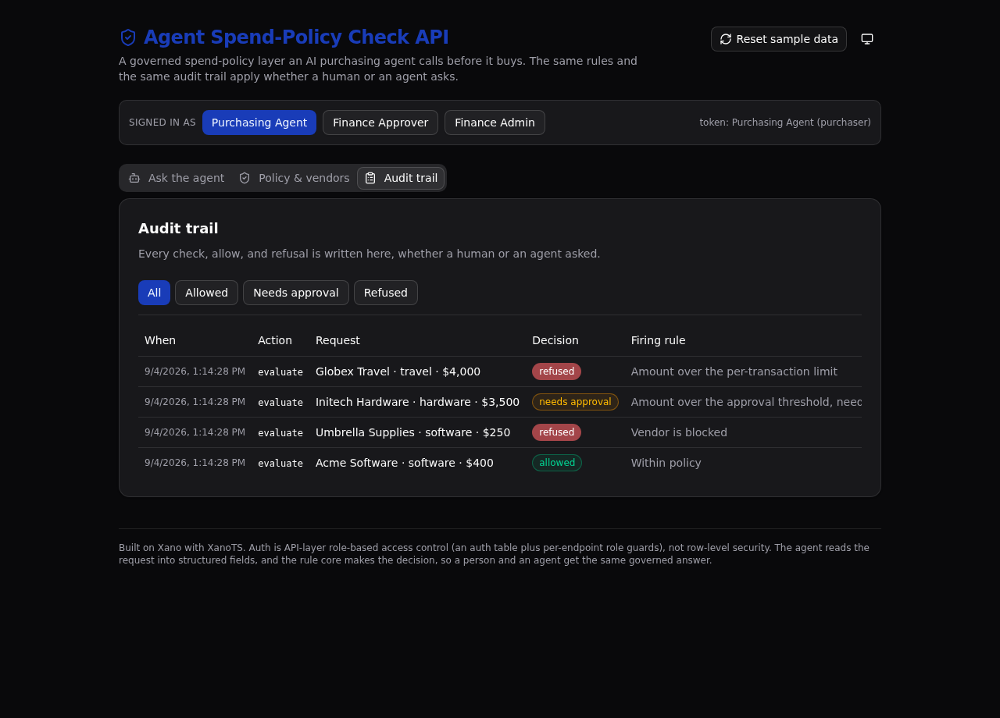

# Agent Spend-Policy Check API

**A governed spend-policy API an AI purchasing agent calls before it buys.** One versioned rule set decides
every purchase, a person and an agent get the same answer, and every check lands in one audit trail.

`Play 4 · Agent Intelligence Layer` · `Corporate finance operations` · **5 tables · 7 endpoints · 1 rule function · 1 AI agent**



## What it demonstrates

An autonomous purchasing agent should not decide on its own what the company is allowed to buy. This backend
puts one governed rule set between the agent and the spend. The agent reads a plain-language request, and a
single rule core answers one question: may this purchase proceed? The same core answers whether a person or
an agent asks, and it writes an audit row every time.

The proof is control, not speed. A Xano evaluator can read the whole rule core in one file, see the roles
enforced at the API layer (not row-level security), and open the audit trail to check that every refusal
names the exact rule that fired.

Built with [XanoTS](https://www.npmjs.com/package/@xanots/sdk), Xano's TypeScript SDK: a typed Xano backend
under `xano/`, a React and Vite frontend under `frontend/`.

## How a decision is made

The rule core (`xano/functions/classify.ts`) loads the active policy for the category and the vendor status,
then applies the rules in order. The first match wins:

1. No active policy for the category, **refused**
2. Vendor is not on the approved list, **refused**
3. Vendor is blocked, **refused**
4. Amount over the per-transaction limit, **refused**
5. Amount over the approval threshold, **needs human approval**
6. Otherwise, **allowed**

The decision is never the model's. The agent-check endpoint has the agent read a request into structured
fields (vendor, category, amount), then runs the **same** rule core a human's `evaluate` call runs. So a
person and an agent get the same governed answer, under the same audit.

## Repo layout

```
xano/
  index.ts                default-exports the workspace, registering everything
  tables/                 agents, spend_policies, vendors, spend_requests, agent_actions
  functions/classify.ts   the shared rule core (the one place a decision is made)
  agents/spend-agent.ts   the AI agent (structured extraction, on Xano's free model)
  api/                    the API group + the seven endpoints
  xano.lock               pinned object identity + public URLs (committed)
frontend/
  src/lib/api.ts          the one contract: paths + types derived from the query defs
  src/App.tsx             the three screens
```

## API surface

All paths sit under the pinned `spend` API group (`/api:spend/...`).

| Method | Path | Auth | What it enforces |
| --- | --- | --- | --- |
| POST | `/api:spend/login` | public | Sign in as a seeded agent, return a bearer token. |
| POST | `/api:spend/evaluate` | agent | Run the rule core, record the request, write an audit row. |
| POST | `/api:spend/agent-check` | agent | The agent reads a plain-language request; the rule core decides. |
| POST | `/api:spend/commit` | agent | Commit a decision behind a role guard (purchaser cannot commit over threshold). |
| GET | `/api:spend/actions` | agent | The audit trail, newest first, filterable by decision. |
| GET | `/api:spend/policies` | public | The active policy per category and the vendor list. |
| POST | `/api:spend/seed` | public | Reset and load the sample data. |

Auth is API-layer role-based access control: the `agents` table backs identity, `login` mints a bearer
token, and each protected endpoint names that table and reads the caller with `auth(...)`. Roles are checked
per endpoint with `s.precondition`. There is no row-level security anywhere in this app.

## The three screens

- **Ask the agent** — type a purchase in plain words. The agent reads it and the rule core returns the
  governed decision with the rule that fired. Watch an in-policy buy get allowed and an over-threshold or
  blocked-vendor buy get refused.
- **Policy and vendors** — the active spend policy per category (limits and thresholds) and the vendor allow
  and block list, so you can read the rules a decision came from.
- **Audit trail** — every check, allow, and refusal, newest first, with the decision, the firing rule, and
  the policy version. The governance payoff.

## Quick start

Take it from clone to a live Xano environment in about a minute.

```sh
git clone https://github.com/xano-scratch/agent-spend-policy-api
cd agent-spend-policy-api
npm install
npx xanots login          # one-time browser auth with Xano
npm run xano:deploy       # builds the frontend, deploys backend + frontend, prints the live URL
```

Then load the sample data so the screens have something to show:

```sh
curl -X POST "<printed-backend-url>/api:spend/seed"
```

Open the printed frontend URL. It auto-signs-in as the Purchasing Agent (demo password `demo-spend-2026`);
use the role switcher to sign in as the Finance Approver and watch the commit guard change.

Other scripts: `npm run dev` (frontend only), `npm run typecheck`, `npm run xano:export` (compile the
backend), `npm run xano:test` (run the deployed environment's tests).

## FAQ

**Does the AI agent make the decision?** No. The agent only reads the request into structured fields. The
decision always comes from the rule core, the same one a human's `evaluate` call uses. That is the whole
point: an agent gets the same answer, under the same controls, as a person.

**Which model does the agent use?** Xano's free model, so there are no external credentials to set. The
agent does structured extraction, and deterministic fallbacks (a keyword scan for the category, a digit scan
for the amount) fill any field it leaves out, so a thin extraction still yields a governed result.

**How are roles enforced?** At the API layer. Each protected endpoint reads the caller's role and guards with
`s.precondition`. A purchaser can commit a request that is within policy but is refused on one that needs
approval; an approver can commit that one. Every attempt, allowed or refused, is written to the trail.

**Can I change the rules?** Yes. Edit the vendors and the policy versions in `xano/api/seed.ts`, or the rule
order in `xano/functions/classify.ts`, then redeploy. One active policy version per category; older versions
stay for audit.

---

Built on [Xano](https://www.xano.com) with [XanoTS](https://www.npmjs.com/package/@xanots/sdk). This is an
experimental proof artifact that runs on sample data, not a live customer system.
